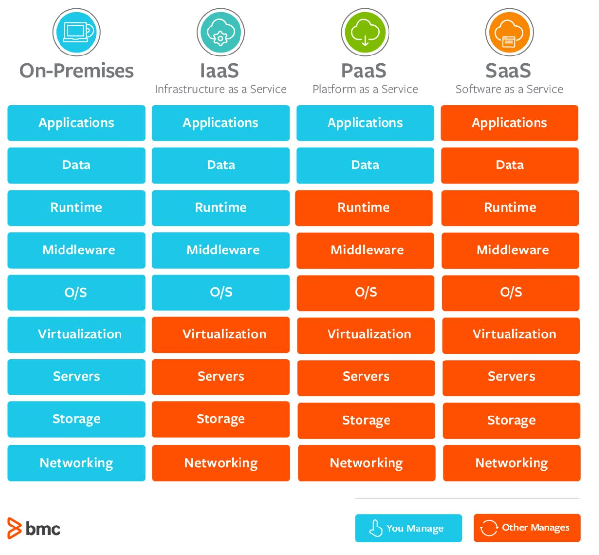

# SaaS-PaaS-IaaS
SaaS vs PaaS vs IaaS 

> Key Differences

> Common Examples of SaaS, PaaS, & IaaS

- SaaS

Google Apps, Dropbox, Salesforce, Cisco WebEx, Concur, GoToMeeting

- PaaS

AWS Elastic Beanstalk, Windows Azure, Heroku, Force.com, Google App Engine, Apache Stratos, OpenShift

- IaaS

DigitalOcean, Linode, Rackspace, Amazon Web Services (AWS), Cisco Metapod, Microsoft Azure, Google Compute Engine (GCE)
